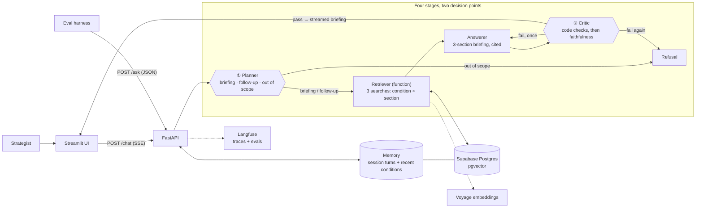

# FDErun — Condition Briefing

[](https://github.com/sandeepjunaghare/FDErun/actions/workflows/ci.yml)

A health-system strategist enters a medical condition and gets, in under a minute, a briefing in three sections: **current standard of care**, **emerging treatments**, and **key companies and institutions**. Every claim cites a source, and the source label and as-of date show next to it. Clinical or patient-specific questions, unknown conditions and anything unrelated are refused rather than answered.

**Stack:** Anthropic Messages API · FastAPI (SSE) · Supabase Postgres + pgvector · Voyage embeddings · Streamlit · Langfuse · Docker → Render

> **Synthetic data.** The corpus is a synthetic sample: 10 chronic-care conditions × 3 sections = 30 documents. Standard of care is real at a general level; every company, drug code and trial network is fictional and tagged "(fictional)". No real health data or patient information enters the system. Data card: [`corpus/condition-briefing/README.md`](corpus/condition-briefing/README.md).

> **Status:** deploy, health checks, database, eval harness and the corpus are built and verified. The pipeline (`api/agents/`), retrieval and ingest (`api/rag/`), memory and the briefing UI are built in parallel tickets ([`docs/tickets/condition-briefing.md`](docs/tickets/condition-briefing.md)); the layout below marks what exists today.

Intent: [`docs/condition-briefing.prd.md`](docs/condition-briefing.prd.md) · design: [`docs/architecture.md`](docs/architecture.md)

---

## Architecture



1. **Planner** (decision point ①, `claude-haiku-4-5`): classifies the request as a briefing, a follow-up about the current briefing, or out of scope, and resolves the condition from its name or an alias ("CHF" → heart failure). Out of scope is refused before any retrieval runs.
2. **Retriever**: three searches, one per section, each filtered to the resolved condition and that section, so every section draws only on evidence labeled for it.
3. **Answerer** (`claude-sonnet-5-5`): drafts the briefing under three fixed headings, citing a chunk for every claim.
4. **Critic** (decision point ②, `claude-haiku-4-5`): code checks first (citations present, every citation was retrieved, each claim cites only chunks from its own section), then a model check that every claim is supported. Fail → the answerer retries once → refuse. Nothing unchecked is streamed.

**Why the retriever is a function, not an agent:** it has no choice to make. Given a condition and a section the search is fully determined, so a model call would only add latency and a way to be wrong. Autonomy sits only where there is a real decision: the planner's routing and the critic's gate. Each is a separate model call with its own prompt and typed contract, so the stage that writes the briefing never also approves it. Alternatives considered (one tool-using model in a loop; functions plus one model call) and why they lost: [`docs/architecture.md`](docs/architecture.md#approaches-considered).

| Component | Choice | Why |
|---|---|---|
| Orchestration | Planner → retriever (function) → answerer → critic, one critic → answerer retry | Predictable and testable stage by stage; the critic is the last gate before the user |
| Framework | Anthropic Messages API, FastAPI with SSE | Outputs are checked against Pydantic schemas, so guardrails live in code, not prompts |
| Vector DB | pgvector on Supabase | One managed Postgres holds vectors, labels and user memory, identical locally and on Render |
| Retrieval | Semantic search with a hard filter on condition + section, top-k per section | Once filtered, the candidate set is a handful of chunks; keyword search is deferred and added back only if the eval hit rate falls short |
| Embeddings | Voyage AI `voyage-4`, 1024 dims | Anthropic's recommended provider; 1024 fits a pgvector HNSW index; swapping is one config line |
| Memory | Session turns (follow-ups answer from the same evidence) + per-user recent conditions | Two layers, scoped per user, both visible in the UI |
| Guardrails | Scope refusal, PII redaction on input, required citations, **section integrity** (the domain rule) | A claim in the wrong section is the PRD's failure condition, so it is enforced in code |
| Front end | Streamlit | Fastest path to a briefing view with source labels, as-of dates and memory on screen |

Full decision log: [`research/tech-stack.md`](research/tech-stack.md).

### Repository layout

```
api/                  FastAPI service (Render web service)
  main.py             app, DB pool lifespan, health + smoke routes ✅ built
                      POST /ask, POST /chat, GET /recent           ⏳ T1
  config.py           settings from environment                   ✅ built
  db/                 pool, health probe, smoke, SQL migrations   ✅ built
    migrations/       conditions, documents, chunks, memory       ⏳ T2
  agents/ schemas/ guardrails/ memory/   pipeline + checks         ⏳ T1
  rag/                ingest, search, conditions                  ⏳ T2
  tests/              pytest (unit + Supabase integration)        ✅ built
ui/                   Streamlit app: API + DB status skeleton     ✅ built
                      briefing view, sources, recent conditions   ⏳ T3
evals/                eval harness: runner, metrics, Claude judge ✅ built
  golden/condition-briefing.yaml  10–15 cases                     ⏳ T2
corpus/condition-briefing/  30 synthetic documents + data card    ✅ built
scripts/check_db.py   standalone Supabase + pgvector check        ✅ built
scripts/check_corpus.py  corpus label check                       ✅ built
scripts/check_embeddings.py  Voyage embedding check (voyage-4, 1024)  ✅ built
scripts/smoke.sh      deploy smoke test for any URL               ✅ built
render.yaml           Render Blueprint (api + ui)                 ✅ built
docker-compose.yml    local container run                         ✅ built
```

---

## Run

### Prerequisites

- [uv](https://docs.astral.sh/uv/) (Python 3.12 is installed automatically)
- Docker (optional, to run in a container)
- A Supabase project with the `vector` extension enabled (Database → Extensions → `vector`)

### 1. Configure

```bash
cp .env.example .env   # .env is gitignored
```

Set three keys:

| Key | Where it comes from | Used by |
|---|---|---|
| `DATABASE_URL` | Supabase → Connect → Direct → **Session pooler**, port 5432 | everything |
| `ANTHROPIC_API_KEY` | console.anthropic.com → API keys | planner, answerer, critic; the eval judge |
| `VOYAGE_API_KEY` | dash.voyageai.com → API keys | ingest (document embeddings) and the retriever (query embeddings) |

The other keys in [`.env.example`](.env.example) have working defaults (embedding model and dimension, eval judge model, `API_URL`) or are optional (Langfuse).

Use the **session pooler**, not the direct connection: the direct host is IPv6-only on the free plan and fails from Docker and Render.

### 2. Check the database

```bash
uv run --script scripts/check_db.py
```

Expected: `PASS` for connect, extension and a vector round-trip, then `OK: Supabase + pgvector ready`.

### 3. Apply migrations

```bash
cd api && uv run python -m db.migrate
```

Applies each file in `api/db/migrations/` once, in order (re-running is a no-op). Local and Render share the same Supabase database, so this only ever runs from your machine. Every table has row-level security enabled, which keeps it out of Supabase's public REST API.

This creates the `conditions`, `documents` and `chunks` tables (condition and section are carried on every chunk, so retrieval is one filtered query) and the memory tables (`sessions`, `turns`, `recent_conditions`).

### 4. Load the corpus

```bash
uv run --script scripts/check_corpus.py corpus/condition-briefing   # labels check, from the repo root
cd api && uv run python -m rag.ingest ../corpus/condition-briefing
```

Ingest refuses a corpus that fails the labels check. It then reads each document's labels (condition, `section`, `source_label`, `as_of`), splits it into paragraph chunks, embeds them with Voyage (`input_type="document"`) and upserts them into pgvector. Chunk ids are stable (`<condition-slug>-<section>-<ord>`), so re-running never duplicates. Like migrations, it runs once from your machine against the shared database; Render never runs it. Skip it and the API starts but every briefing is refused for lack of sources.

### 5. Start the API and the UI

```bash
cd api && uv sync && uv run uvicorn main:app --reload --port 8710   # terminal 1
cd ui && uv sync && uv run streamlit run app.py                      # terminal 2, http://localhost:8711
```

Or both in Docker, from the repo root (UI on <http://localhost:8711>):

```bash
docker compose up --build
```

Render down or CI red? `docs/runbook-local.md` runs and demos the whole app locally, with Docker or plain uv.

### 6. Verify

```bash
scripts/smoke.sh            # defaults to http://localhost:8710
```

| Check | Route | Proves |
|---|---|---|
| health | `GET /health` | the process is up |
| version | `GET /version` | which git commit is deployed (`local` outside Render) |
| health/db | `GET /health/db` | Supabase is reachable and pgvector is installed |
| smoke | `POST /smoke` | insert, read-back and vector similarity search on a real table, in one transaction that is rolled back, so nothing persists |

Failures return **503** with the error class only (`UndefinedTable` means migrations haven't run). The API still starts when the database is down, so the failure is reported rather than crash-looping.

Then ask for a briefing:

```bash
curl -s localhost:8710/ask -H 'content-type: application/json' \
  -d '{"question": "Briefing on CHF", "user_id": "demo"}'
```

Expect `action: "answer"`, an `answer` with the three headings (`## Current standard of care`, `## Emerging treatments`, `## Key companies and institutions`), and `citations` that are ids in `retrieved`, each with its `section`, `source_label` and `as_of`. "CHF" resolves to heart failure. A patient-specific question ("what dose should my patient take?") or an unknown condition returns `action: "refuse"`. In the UI, the same request streams the stage in progress, then the briefing with the source label and as-of date beside each citation.

### Tests

```bash
cd api
uv run pytest                  # unit tests, database stubbed, no network
uv run pytest -m integration   # against the real Supabase in DATABASE_URL
```

### Lint and type-check

```bash
cd api
uv run ruff check . ../scripts           # lint (add --fix to auto-fix)
uv run ruff format --check . ../scripts  # formatting
uv run pyright                           # type-check (standard mode)
```

### CI

[`.github/workflows/ci.yml`](.github/workflows/ci.yml) runs on every push to `main` and every pull request:

| Job | What it runs |
|---|---|
| Lint, type-check, unit tests | ruff check, ruff format --check, pyright, pytest |
| Docker build | builds `api/Dockerfile` (no push), so a broken image fails before Render deploys it |
| Secret scan | gitleaks over the full history (`.gitleaks.toml`), so a key pasted into a tracked file fails the build |
| Evals harness | lint, types, tests and a self-test of `evals/` on the fake pipeline |
| Integration tests | `pytest -m integration` against Supabase. Runs only if the `DATABASE_URL` repo secret is set |

To enable integration tests in CI: **Settings → Secrets and variables → Actions → New repository secret**, name `DATABASE_URL`, value = the session-pooler URL.

---

## Eval

> ✅ Harness built (`evals/`, see [`evals/README.md`](evals/README.md)). ⏳ Golden set `evals/golden/condition-briefing.yaml` (T2) and `POST /ask` (T1) land with their tickets.

| Metric | What it measures | How |
|---|---|---|
| Retrieval hit rate @k | Did each section's search find the passage that holds the answer? | Expected doc + snippet in the top-k chunks; deterministic, survives re-chunking |
| Citations | Does every claim cite something it actually retrieved? | Deterministic |
| Guardrails | Are out-of-scope, PII and domain-rule questions refused or redacted, and answerable ones not over-refused? | Deterministic |
| Faithfulness | Is every claim supported by the retrieved text? | Claude as judge (Haiku 4.5), structured score + unsupported claims; optional Langfuse traces |

```bash
cd evals
uv run python run.py golden/condition-briefing.yaml --target http://localhost:8710
uv run python run.py golden/condition-briefing.yaml --only <case-id> --compare results/<earlier>.json   # fix → rerun
```

- **Golden set (10–15 cases):** briefings across the 10 conditions with the expected source per section, an alias ("CHF" → heart failure), a follow-up in the same session, out of scope (an unknown condition; the weather), the domain rule (patient-specific treatment advice → refuse) and PII (a question naming a patient → redact).
- **Pass bar, from the PRD:** 100% of claims cited; ≤ 1 in 10 briefings with an unsupported or wrong-section claim; a briefing in under a minute. If the hit rate falls short, add keyword search (deferred, see Architecture) and revisit chunking before tuning prompts.
- **Loop:** run, read the failing case's reason, fix the prompt, retrieval or guardrail, rerun just that case, then compare before → after.

---

## Deploy

> Step-by-step procedure, troubleshooting, rollback and password rotation: [`docs/runbook-deploy.md`](docs/runbook-deploy.md).

Render builds the Docker images from this repo itself; nothing is built or uploaded from your machine. Both services are defined in [`render.yaml`](render.yaml) (a Render Blueprint).

```
local: scripts/smoke.sh   →   git push   →   CI green   →   Render builds api/Dockerfile   →   scripts/smoke.sh <url>
```

### One-time setup

1. Apply migrations and load the corpus from your machine (Run → steps 3 and 4). Render never runs either.
2. Render → **New → Blueprint** → connect this GitHub repo. Render reads `render.yaml`:

   | Setting | Value |
   |---|---|
   | Services | `fderun-api` and `fderun-ui`, Docker, free plan, region `virginia` (next to Supabase us-east-1) |
   | Build | `api/Dockerfile` (context `api/`) and `ui/Dockerfile` (context `ui/`) |
   | Health check | `/health` (api), `/_stcore/health` (ui) |
   | Auto-deploy | after GitHub checks pass, only when that service's folder changes |
   | Secrets (api) | `DATABASE_URL`, `ANTHROPIC_API_KEY`, `VOYAGE_API_KEY`, entered when prompted (`sync: false`); the same values as `.env`; never committed |
   | `API_URL` (ui) | set in `render.yaml`; a public URL, not a secret |

   Paste only the value: no `KEY=` prefix, no quotes, no `<placeholders>`. The API refuses to start on a malformed `DATABASE_URL`, and the deploy log says why. To copy it from `.env` (prints it with the password masked):

   ```bash
   scripts/copy-db-url.sh
   ```

3. When the deploy is live:

   ```bash
   scripts/smoke.sh https://<your-service>.onrender.com latest --wait
   ```

   `--wait` polls until the deploy is up, then runs the checks. `latest` also fails unless the live commit has the same `api/` code as your `HEAD`, so after a push you know the new code is serving, not the previous deploy. (Pushes that don't touch `api/` don't redeploy; `latest` accepts that because the API code is unchanged.)

After that, every push to `main` that touches `api/` or `ui/` redeploys that service once CI is green.

### Notes

- `/health` never touches the database, so a Supabase blip can't block a deploy. `scripts/smoke.sh` checks the data path.
- The container listens on Render's `$PORT` (8710 in docker compose) and runs as a non-root user.
- Free instances sleep when idle. The first request after a pause can take 30–60 s (the smoke script waits up to 90 s), so warm both URLs before a demo.
- Check the UI at <https://fderun-ui.onrender.com>: the sidebar shows ✅ for the API and database.

---

## Handoff

### What you're getting

| Piece | Where | Start here |
|---|---|---|
| The product decision: problem, users, hypothesis, non-goals | [`docs/condition-briefing.prd.md`](docs/condition-briefing.prd.md) | Read first |
| The technical decisions and why | [`docs/architecture.md`](docs/architecture.md), [`research/tech-stack.md`](research/tech-stack.md) | Then this |
| The data: what's synthetic, labels, as-of dates | [`corpus/condition-briefing/README.md`](corpus/condition-briefing/README.md), [`docs/walkthrough-data.md`](docs/walkthrough-data.md) | Before showing it to anyone |
| How the code is laid out, conventions, commands | [`CLAUDE.md`](CLAUDE.md) | For anyone (or any agent) changing code |
| Deploy, rollback, rotate the database password | [`docs/runbook-deploy.md`](docs/runbook-deploy.md) | Before touching production |
| Quality bar: golden set + eval harness | `evals/`, `evals/golden/condition-briefing.yaml` | Before changing prompts, retrieval or guardrails |
| A one-page explanation for strategists | [`docs/visual/presentation_deck.html`](docs/visual/presentation_deck.html) | For stakeholders |

### Who owns what

| Area | Owner | Why it matters |
|---|---|---|
| **Golden eval set** (`evals/golden/`) | **A strategist on the health-system strategy team**, with an engineer maintaining the harness | The set defines "correct". It must come from the people who know the answers, and grow with every real failure |
| Source documents, labels and their freshness | The strategy team's research lead (whoever replaces the synthetic corpus with real sources) | A briefing is only as current as its as-of dates; each section's date is shown on screen |
| Guardrail rules (what it refuses: clinical and patient-specific advice, unknown conditions) | The strategy team's product owner, reviewed by engineering | The cost of a wrong answer sets how strict these are |
| Prompts, retrieval, agents | Engineering | Change only with an eval run before and after (`run.py --compare`) |
| Deploys, secrets, rotation | Engineering | `docs/runbook-deploy.md`; secrets live only in `.env` and Render, and CI blocks leaked keys |

### Changing it safely

1. Run the eval set and save the result: `cd evals && uv run python run.py golden/condition-briefing.yaml`.
2. Make the change, then re-run with `--compare results/<before>.json`. Ship only if no case broke.
3. Every real-world wrong answer becomes a new golden case before it's fixed.

### What to watch first in production

| Signal | Why | Where |
|---|---|---|
| Retrieval hit rate per section | Most wrong answers start as a retrieval miss; a weak section points at its documents | Eval harness on a weekly sample |
| Refusal rate, and critic retries | Too high means strategists give up; too low means guardrails are leaking | `action` in `/ask` responses, Langfuse |
| Faithfulness and section integrity | Catches claims that sound right but aren't in the sources, or sit in the wrong section | Claude judge, critic results in Langfuse |
| Time to briefing and cost per briefing | The PRD's under-a-minute target, and whether it scales | Langfuse traces |

### Known limits and Release 2

- **Synthetic corpus:** 10 conditions, 30 documents; companies, drug codes and trial networks are fictional. Fine for proving the flow, not for a real decision.
- **Only the sample conditions:** anything else gets "no sources for this condition", by design.
- **Semantic search only:** keyword search is deferred until the eval hit rate asks for it.
- **No live sources, no export:** no PubMed, trial registries or news feeds; no PDF or slides (PRD non-goals strategists will ask for).
- **Not clinical decision support:** clinical and patient-specific questions are refused.
- **Release 2:** real sources with the same labels and section check, plus a flag on any section whose as-of date is older than a threshold the team sets. Hypothesis: visible freshness lets strategists trust a briefing without re-checking every source.

### If two engineers picked this up next week

- **Engineer 1:** retrieval and evals. Grow the golden set from real strategist questions, then tune chunking, top-k and (if needed) keyword search against it.
- **Engineer 2:** sources and feedback. Load the first real sources under the same labels, and add a thumbs-up/down that writes back to Langfuse so real usage feeds the golden set.
- **Kept with the lead:** the guardrail and critic rules (scope, section integrity), because a mistake there is the most expensive kind.
