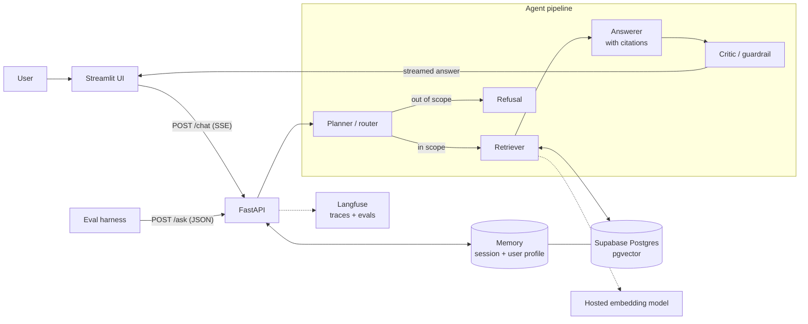

# FDErun

[](https://github.com/sandeepjunaghare/FDErun/actions/workflows/ci.yml)

A retrieval-augmented (RAG) assistant built as a four-agent pipeline that answers only from your documents, cites its sources, and refuses what is out of scope.

**Stack:** Anthropic Messages API · FastAPI (SSE) · Supabase Postgres + pgvector · Streamlit · Langfuse · Docker → Render

> **Status:** the API skeleton, Supabase connection and health checks are built and tested. The agents, retrieval, memory, UI and evals below are the target design and land incrementally. Each section marks what exists today.

---

## Architecture



| Component | Choice | Why |
|---|---|---|
| Orchestration | Planner → Retriever → Answerer → Critic | Each agent has one job; the critic is the last gate before the user |
| Framework | Anthropic Messages API, FastAPI with SSE | Outputs are checked against Pydantic schemas, so guardrails live in code, not prompts |
| Vector DB | pgvector on Supabase | One managed Postgres holds vectors and user memory, identical locally and on Render |
| Embeddings | Voyage AI `voyage-4`, 1024 dims, $0.06/1M tokens (200M free) | Anthropic's recommended provider; 1024 fits a pgvector HNSW index; swapping is one config line |
| Memory | Session (conversation) + persistent (user profile in Postgres) | Two layers, scoped per user, both visible in the UI |
| Guardrails | Pydantic schemas, scope classifier, PII redaction, required citations, out-of-scope refusal, one domain rule | The cost of a wrong answer decides how strict to be |
| Front end | Streamlit | Fastest path to a usable chat UI with citations and memory on screen |

Full decision log: [`research/tech-stack.md`](research/tech-stack.md).

### Repository layout

```
api/                  FastAPI service (Render web service)
  main.py             app, DB pool lifespan, health + smoke routes ✅ built
  config.py           settings from environment                   ✅ built
  db/                 pool, health probe, smoke, SQL migrations   ✅ built
  tests/              pytest (unit + Supabase integration)        ✅ built
  agents/ schemas/ guardrails/ memory/ rag/                       ⏳ planned
ui/                   Streamlit app: API + DB status skeleton     ✅ built
                      chat view, second Render service            ⏳ planned
evals/                eval harness: runner, metrics, Claude judge ✅ built
  golden/<scenario>.yaml  per-scenario golden set                 ⏳ planned
scripts/check_db.py   standalone Supabase + pgvector check        ✅ built
scripts/smoke.sh      deploy smoke test for any URL               ✅ built
scripts/check_embeddings.py  Voyage embedding check (voyage-4, 1024)  ✅ built
render.yaml           Render Blueprint                            ✅ built
docker-compose.yml    local container run                         ✅ built
```

---

## Run

### Prerequisites

- [uv](https://docs.astral.sh/uv/) (Python 3.12 is installed automatically)
- Docker (optional, to run in a container)
- A Supabase project with the `vector` extension enabled (Database → Extensions → `vector`)

### 1. Configure

```bash
cp .env.example .env   # .env is gitignored
```

Set `DATABASE_URL` (Supabase → Connect → Direct → **Session pooler**, port 5432). The other keys in [`.env.example`](.env.example) are only needed as the agents, evals and UI land.

Use the **session pooler**, not the direct connection: the direct host is IPv6-only on the free plan and fails from Docker and Render.

### 2. Check the database

```bash
uv run --script scripts/check_db.py
```

Expected: `PASS` for connect, extension and a vector round-trip, then `OK: Supabase + pgvector ready`.

### 3. Apply migrations

```bash
cd api && uv run python -m db.migrate
```

Applies each file in `api/db/migrations/` once, in order (re-running is a no-op). Local and Render share the same Supabase database, so this only ever runs from your machine. Every table has row-level security enabled, which keeps it out of Supabase's public REST API.

### 4. Start the API

```bash
cd api
uv sync
uv run uvicorn main:app --reload --port 8710
```

Or API + UI in Docker, from the repo root (UI on <http://localhost:8711>):

```bash
docker compose up --build
```

Render down or CI red? `docs/runbook-local.md` runs and demos the whole app locally, with Docker or plain uv.

### 5. Verify

```bash
scripts/smoke.sh            # defaults to http://localhost:8710
```

| Check | Route | Proves |
|---|---|---|
| health | `GET /health` | the process is up |
| version | `GET /version` | which git commit is deployed (`local` outside Render) |
| health/db | `GET /health/db` | Supabase is reachable and pgvector is installed |
| smoke | `POST /smoke` | insert, read-back and vector similarity search on a real table, in one transaction that is rolled back, so nothing persists |

Failures return **503** with the error class only (`UndefinedTable` means migrations haven't run). The API still starts when the database is down, so the failure is reported rather than crash-looping.

### Tests

```bash
cd api
uv run pytest                  # unit tests, database stubbed, no network
uv run pytest -m integration   # against the real Supabase in DATABASE_URL
```

### Lint and type-check

```bash
cd api
uv run ruff check . ../scripts           # lint (add --fix to auto-fix)
uv run ruff format --check . ../scripts  # formatting
uv run pyright                           # type-check (standard mode)
```

### CI

[`.github/workflows/ci.yml`](.github/workflows/ci.yml) runs on every push to `main` and every pull request:

| Job | What it runs |
|---|---|
| Lint, type-check, unit tests | ruff check, ruff format --check, pyright, pytest |
| Docker build | builds `api/Dockerfile` (no push), so a broken image fails before Render deploys it |
| Secret scan | gitleaks over the full history (`.gitleaks.toml`), so a key pasted into a tracked file fails the build |
| Evals harness | lint, types, tests and a self-test of `evals/` on the fake pipeline |
| Integration tests | `pytest -m integration` against Supabase. Runs only if the `DATABASE_URL` repo secret is set |

To enable integration tests in CI: **Settings → Secrets and variables → Actions → New repository secret**, name `DATABASE_URL`, value = the session-pooler URL.

---

## Eval

> ✅ Harness built (`evals/`, see [`evals/README.md`](evals/README.md)). Per scenario: write the golden set; the API implements `POST /ask`.

| Metric | What it measures | How |
|---|---|---|
| Retrieval hit rate @k | Did retrieval find the passage that holds the answer? | Expected doc + snippet in the top-k chunks; deterministic, survives re-chunking |
| Citations | Does every answer cite something it actually retrieved? | Deterministic |
| Guardrails | Are out-of-scope, PII and domain-rule questions refused/redacted/escalated, and answerable ones not over-refused? | Deterministic |
| Faithfulness | Is every claim supported by the retrieved text? | Claude as judge (Haiku 4.5), structured score + unsupported claims; optional Langfuse traces |

```bash
cd evals
uv run python run.py golden/<scenario>.yaml --target http://localhost:8710
uv run python run.py golden/<scenario>.yaml --only <case-id> --compare results/<earlier>.json   # fix → rerun
```

- **Golden set:** 10–15 question/answer pairs with their source doc + snippet, including out-of-scope, PII and domain-rule cases.
- **Loop:** run, read the failing case's reason, fix the prompt, retrieval or guardrail, rerun just that case, then compare before → after.

---

## Deploy

> Step-by-step procedure, troubleshooting, rollback and password rotation: [`docs/runbook-deploy.md`](docs/runbook-deploy.md).

Render builds the Docker image from this repo itself; nothing is built or uploaded from your machine. The service is defined in [`render.yaml`](render.yaml) (a Render Blueprint).

```
local: scripts/smoke.sh   →   git push   →   CI green   →   Render builds api/Dockerfile   →   scripts/smoke.sh <url>
```

### One-time setup

1. Apply migrations from your machine (see Run → step 3).
2. Render → **New → Blueprint** → connect this GitHub repo. Render reads `render.yaml`:

   | Setting | Value |
   |---|---|
   | Service | `fderun-api`, Docker, free plan, region `virginia` (next to Supabase us-east-1) |
   | Build | `api/Dockerfile`, context `api/` |
   | Health check | `/health` |
   | Auto-deploy | after GitHub checks pass, only when `api/**` changes |
   | `DATABASE_URL` | entered when prompted: the same session-pooler URL as `.env`; never committed |

   Paste only the URL: no `DATABASE_URL=` prefix, no quotes, no `<placeholders>`. The API refuses to start on any of those, and the deploy log says which. To copy it from `.env` (prints it with the password masked):

   ```bash
   scripts/copy-db-url.sh
   ```

3. When the deploy is live:

   ```bash
   scripts/smoke.sh https://<your-service>.onrender.com latest --wait
   ```

   `--wait` polls until the deploy is up, then runs the checks. `latest` also fails unless the live commit has the same `api/` code as your `HEAD`, so after a push you know the new code is serving, not the previous deploy. (Pushes that don't touch `api/` don't redeploy; `latest` accepts that because the API code is unchanged.)

After that, every push to `main` that touches `api/` redeploys once CI is green.

### Notes

- `/health` never touches the database, so a Supabase blip can't block a deploy. `scripts/smoke.sh` checks the data path.
- The container listens on Render's `$PORT` (8710 in docker compose) and runs as a non-root user.
- Free instances sleep when idle. The first request after a pause can take 30–60 s (the smoke script waits up to 90 s), so warm the URL before a demo.
- The Streamlit UI will be a second service in `render.yaml`, with `API_URL` pointing at this one.

---

## Handoff

> Fields in `<angle brackets>` are filled in per scenario. Everything else holds for any deployment of this kit.

### What you're getting

| Piece | Where | Start here |
|---|---|---|
| The product decision: problem, users, hypothesis, non-goals | `docs/<slug>.prd.md` | Read first |
| The technical decisions and why | `docs/architecture.md`, `research/tech-stack.md` | Then this |
| How the code is laid out, conventions, commands | `CLAUDE.md` | For anyone (or any agent) changing code |
| Deploy, rollback, rotate the database password | `docs/runbook-deploy.md` | Before touching production |
| Quality bar: golden set + eval harness | `evals/`, `evals/golden/<scenario>.yaml` | Before changing prompts, retrieval or guardrails |
| A one-page explanation for non-technical readers | `docs/visual/one-page.html` | For stakeholders |

### Who owns what

| Area | Owner | Why it matters |
|---|---|---|
| **Golden eval set** (`evals/golden/`) | **<client domain expert>**, with an engineer maintaining the harness | The set defines "correct". It must come from the people who know the answers, and grow with every real failure |
| Source documents and their freshness | <data owner> | Answers are only as current as the documents behind them |
| Guardrail rules (what it refuses or escalates) | <product owner>, reviewed by engineering | The cost of a wrong answer sets how strict these are |
| Prompts, retrieval, agents | Engineering | Change only with an eval run before and after (`run.py --compare`) |
| Deploys, secrets, rotation | Engineering | `docs/runbook-deploy.md`; secrets live only in `.env` and Render, and CI blocks leaked keys |

### Changing it safely

1. Run the eval set and save the result: `cd evals && uv run python run.py golden/<scenario>.yaml`.
2. Make the change, then re-run with `--compare results/<before>.json`. Ship only if no case broke.
3. Every real-world wrong answer becomes a new golden case before it's fixed.

### What to watch first in production

| Signal | Why | Where |
|---|---|---|
| Retrieval hit rate on sampled questions | Most wrong answers start as a retrieval miss | Eval harness on a weekly sample |
| Refusal / escalation rate | Too high means users give up; too low means guardrails are leaking | `action` in `/ask` responses, Langfuse |
| Faithfulness on sampled answers | Catches answers that sound right but aren't in the sources | Claude judge, Langfuse scores |
| Answer latency and cost per answer | The two numbers that decide whether it scales | Langfuse traces |

### Known limits and Release 2

- <limit found during the build, e.g. "tables inside PDFs are retrieved as plain text">
- <non-goal from the PRD that users will ask for>
- Release 2: <the next slice, and the hypothesis it tests>

### If two engineers picked this up next week

- **Engineer 1:** retrieval and evals. Grow the golden set from real questions, then tune chunking and top-k against it.
- **Engineer 2:** front end and feedback. Add a thumbs-up/down that writes back to Langfuse, so real usage feeds the golden set.
- **Kept with the lead:** the guardrail and critic rules, because a mistake there is the most expensive kind.
