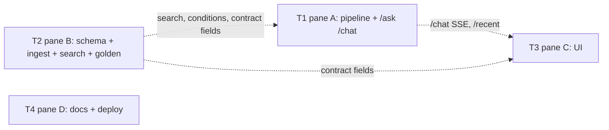

# Ticket Breakdown — Condition Briefing for Health-System Strategists

## Epic summary

A strategist enters a medical condition and gets, in under a minute, a three-section briefing (standard of care,
emerging treatments, key companies/institutions). Every claim cites a source, and the source label and as-of date
show next to it. Out-of-scope and clinical questions are refused. Intent: `docs/condition-briefing.prd.md` ·
how: `docs/architecture.md` · data: `corpus/condition-briefing/` (done, 30 docs; data card in its README).

Four tickets, one per pane, each owning disjoint folders (`docs/runbook-kickoff.md` step 4). They run in
parallel against the **interface notes** below; each pane stubs what another pane owns until merge.

## Interface notes (the seams between panes; pane A owns the shared files)

1. **Settings** (`api/config.py`, pane A, first commit): `anthropic_api_key`, `voyage_api_key`,
   `embedding_model = "voyage-4"`, `embedding_dim = 1024`, all with empty/defaults so the health routes still
   start without them. Pane B codes against these names via `config.get_settings()`.
2. **Search** (`api/rag/search.py`, pane B; called by pane A's retriever):
   `async def search(pool, query: str, condition_id: str, section: Section, k: int = 5) -> list[RetrievedChunk]`.
   Embeds with `input_type="query"`, filters `condition_id` and `section` in SQL, ranks by cosine.
   `Section = Literal["standard_of_care", "emerging_treatments", "key_institutions"]`.
3. **Conditions** (`api/rag/conditions.py`, pane B; called by pane A's planner):
   `async def list_conditions(pool) -> list[Condition]`, where `Condition` has `id`, `name`, `aliases: list[str]`.
4. **Response contract** (`evals/contract.py`, pane B): `RetrievedChunk` gains optional `section: str | None`,
   `source_label: str | None`, `as_of: date | None`. `AskResponse` is otherwise unchanged. Panes A and C import
   or mirror these names exactly.
5. **SSE** (`POST /chat`, pane A; consumed by pane C): `status {"agent": …}` → `token {"text": …}` (only after the
   critic passes) → `done {AskResponse}` (authoritative), per `evals/README.md`.
6. **Memory tables** are created by pane B's migration (pane B owns `api/db/migrations/`) to pane A's shape in T2;
   pane A owns the code that reads and writes them (`api/memory/`).
7. **Request:** `{"question": str, "user_id": str, "session_id": str | None}`. `session_id` is optional, so the
   eval harness's `{"question", "user_id"}` still works.

## Tickets

### T1 — Pane A: four-stage pipeline, guardrails, memory, `/ask` + `/chat`

**Scope / acceptance criteria** — one concern: a request becomes a checked, cited briefing or a refusal.
- `POST /ask` returns `AskResponse`; `POST /chat` streams the same pipeline as SSE (note 5).
- **Planner** (haiku): classifies briefing / follow-up / out of scope; resolves the condition from names and
  aliases (note 3), so "CHF" → heart failure. Unknown condition, clinical or patient-specific advice, and unrelated
  questions → `action="refuse"` before any retrieval.
- **Retriever**: a plain function, not an agent. Three calls to `search` (note 2), one per section, filtered to
  the resolved condition.
- **Answerer** (sonnet): markdown briefing with exactly three headings (`## Current standard of care`,
  `## Emerging treatments`, `## Key companies and institutions`); every claim cites chunk ids.
- **Critic**: code checks first — citations non-empty, ⊆ retrieved ids, and **section integrity** (a claim under
  a heading cites only chunks whose `section` matches) — then an LLM faithfulness check. Fail → one answerer
  retry → refuse. Never streams unchecked text.
- **Guardrails** in `api/guardrails/`: scope (via planner output), PII redaction of patient identifiers on input
  (`action="redact"` when it fires, before storing or sending on), citation check, section-integrity rule.
- **Memory** in `api/memory/`: session turns (follow-up "which of those are Phase 3?" answers from the session's
  last retrieved chunks, still cited); per-user recent conditions, newest first.
- `GET /recent?user_id=` returns the user's recent conditions (for the UI).
- Unit tests stub the LLM, `search`, and the DB: refusal paths, section-integrity rejection, retry-then-refuse,
  follow-up, PII redaction. Errors: one specific exception class; `/ask` returns 503 with the class name only.

**Per-ticket context:** `docs/architecture.md` → Recommended approach, Key decisions (guardrails, memory,
output contract) · `docs/runbook-kickoff.md` → Dry-run lessons (shared LLM helper `agents/llm.py`, models,
critic order, 6.5–8 s budget) · `evals/README.md` (SSE) · interface notes 1–7.
**Files touched:** `api/agents/`, `api/schemas/`, `api/guardrails/`, `api/memory/`, `api/main.py`,
`api/config.py`, `api/pyproject.toml`, `api/uv.lock`, `.env.example`, `CLAUDE.md` (rubric map), `api/tests/`.
**Size:** ~1200–1500 lines incl. tests. **Depends on:** none (stubs notes 2–4 until B merges).

### T2 — Pane B: schema, ingest, search, golden set

**Scope / acceptance criteria** — one concern: the labeled corpus is searchable by condition and section, and
the eval set can judge the briefing.
- Migration `0002_condition_briefing.sql`, every table with `enable row level security` (no policies):
  - `conditions(id text pk, name text, aliases text[])`
  - `documents(doc text pk, condition_id text fk, section text check in the 3 values, title text,
    source_label text, source_type text, as_of date)`
  - `chunks(chunk_id text pk, doc text fk, ord int, condition_id text, section text, text text,
    embedding vector(1024))`, HNSW `vector_cosine_ops` index, btree on `(condition_id, section)`.
- Migration `0003_memory.sql` (shape for pane A): `sessions(session_id text pk, user_id text, created_at)`,
  `turns(id bigserial pk, session_id fk, role text, content text, citations text[], created_at)`,
  `recent_conditions(user_id text, condition_id text, viewed_at timestamptz, pk(user_id, condition_id))`.
- `python -m rag.ingest <corpus-dir>`: runs `scripts/check_corpus.py` logic first (refuse to ingest a bad corpus),
  reads front matter, chunks by paragraph, `chunk_id = "<condition-slug>-<section>-<ord>"` (stable),
  `doc = "<condition-slug>/<section>.md"`, embeds with `input_type="document"`, upserts on conflict. Re-running
  never duplicates.
- `rag.search` and `rag.conditions` per interface notes 2–3; returned chunks carry `section`, `source_label`,
  `as_of` (note 4).
- `evals/contract.py`: optional fields (note 4); existing `example.yaml` still passes against the fake target.
- `evals/golden/condition-briefing.yaml`, 10–15 cases: answerable briefings across conditions (expected_sources
  per section), an alias case ("CHF"), a follow-up, `out_of_scope` (unknown condition; weather), `domain_rule`
  (patient-specific treatment advice → refuse), `pii` (question with a patient name → redact).
- Tests: chunker and front-matter parsing offline; ingest + search round trip as `@pytest.mark.integration`.

**Per-ticket context:** `docs/architecture.md` → Data model, Retrieval · `corpus/condition-briefing/README.md`
(labels, writing rules) · `scripts/check_corpus.py` · Dry-run lessons (ingest + search patterns, Voyage import
path) · interface notes 1–4, 6.
**Files touched:** `api/rag/`, `api/db/migrations/`, `api/tests/test_rag*.py`, `evals/`.
**Size:** ~800–1100 lines incl. tests. **Depends on:** none (reads settings names from note 1).

### T3 — Pane C: briefing UI with sources, dates, and visible memory

**Scope / acceptance criteria** — one concern: a strategist can request, read, and trust a briefing on screen.
- Condition input (free text) and a follow-up box in the same session; `session_id` kept in Streamlit state.
- Streams `/chat`: shows the stage in progress from `status` events (planner → retriever → answerer → critic),
  then the briefing. HTTP timeout ≥ 30 s (the skeleton's 10 s is too short).
- Renders the three sections; each citation shows **source label and as-of date** from `retrieved` (note 4), and
  each section shows its newest as-of date. A visible "Synthetic sample data" badge.
- Refusals and redactions render as a clear message, not an error.
- Sidebar: recent conditions from `GET /recent` (click to re-run); session turns visible (rubric: visible memory).
- Works against a stub `/chat` until A merges; keeps the existing API/DB status panel.

**Per-ticket context:** `evals/README.md` (SSE events) · `docs/walkthrough-data.md` step 4 (what the
stakeholder must see) · interface notes 4, 5, 7 · Dry-run lessons (timeouts).
**Files touched:** `ui/` (keep `ui/Dockerfile`, `.streamlit/config.toml`), ui service in `docker-compose.yml`.
**Size:** ~500–800 lines incl. tests. **Depends on:** none (stub until T1 merges).

### T4 — Pane D: README, deploy config, stakeholder one-pager

**Scope / acceptance criteria** — one concern: a reviewer or the stakeholder can understand, run, and judge it.
- `README.md`: what it does, architecture (the four stages and the two decision points; why the retriever is a
  function), run (migrate → ingest `corpus/condition-briefing` → api → ui), eval (`golden/condition-briefing.yaml`),
  deploy, and the synthetic-data statement with a link to the data card. Handoff section updated.
- `render.yaml`: confirm `ANTHROPIC_API_KEY` and `VOYAGE_API_KEY` on the api service; no new secrets in the file.
- `docs/visual/one-page.html`: non-technical one-pager for the strategist audience (problem, what they get,
  how sources and dates make it trustworthy, what's synthetic), jargon flags clean.
- `docs/walkthrough-data.md`: add the retrieval talking point (semantic search filtered by condition and
  section; keyword search deferred), as `docs/architecture.md` asks.

**Per-ticket context:** `docs/condition-briefing.prd.md` (problem, hypothesis, non-goals) ·
`docs/architecture.md` (approach table, retrieval decision) · `docs/walkthrough-data.md` · `docs/runbook-deploy.md`.
**Files touched:** `README.md`, `docs/` (not `docs/tickets/`), `render.yaml`.
**Size:** ~300–500 lines. **Depends on:** none.

## Dependency graph

Dotted lines are interface dependencies, already fixed in the notes above, not build-order dependencies.

## Suggested execution order

- **Wave 1 (parallel):** T1, T2, T3, T4, each in its own worktree.
- **Merge order:** T2 → T1 (swap stubs for real `search`/`conditions`; run golden set) → T3 (point at real
  `/chat`) → T4. Then `/piv-validate` and the local end-to-end check before deploy.
